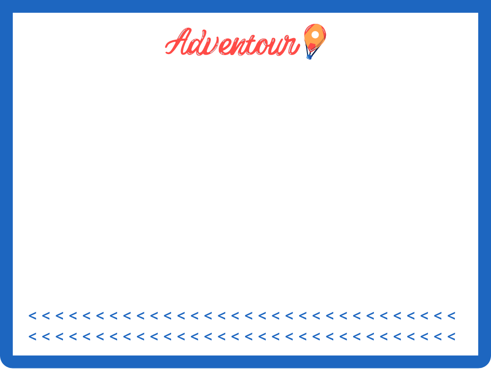

<p align="center">
  
</p>

<p align="center">
  <strong>Travel without the planning spiral.</strong><br />
  Adventour helps people discover local, memorable places through playful recommendations, swipeable discovery, and trip-by-trip journeys worth saving.
</p>

## What Adventour Is

Adventour is a mobile travel companion built around one simple idea: finding something great to do should feel exciting, not exhausting.

Instead of making travelers manually research every restaurant, activity, neighborhood, and hidden gem, Adventour asks where the balloon should land, learns what the user likes, and presents a focused stream of nearby places. Users can pass, accept, get directions, and save each stop into a living Adventour.

The goal is to make travel feel more local, more personal, and less generic.

## Product Experience

### Discover

Set a launch point, pick a search range, and let Adventour scout nearby places. Recommendations are shown as place cards with images, ratings, travel-time hints, tags, and a swipe-style accept/pass flow.

Adventour prioritizes:

- Local and authentic places
- Hidden gems and memorable experiences
- User taste learned from accepts, rejects, ratings, and visits
- Search tags that feel human instead of generic categories
- Lower emphasis on chains and obvious tourist defaults

### Active Adventour

When trip mode is active, accepted places become stops in an Adventour journey. Users can open directions, mark arrival, track time spent, rate the stop, and continue place by place until they end the Adventour.

Finished Adventours become a recap of where the user went, what they liked, and what they can revisit or share later.

### Passport Profile

The profile is designed like a travel passport: personal, collectible, and expressive.

<p align="center">
  
</p>

The Passport shows:

- Profile photo and display name
- Liked places
- Completed Adventours
- Top accepted tags
- Travel stats like cities and countries visited
- Recently liked places on stamp-style cards
- Completed Adventours on ticket-style cards

<p align="center">
  
  &nbsp;&nbsp;
  
</p>

### Friends & Trips

Adventour is being built around social travel, not passive feeds. Users can find friends by display name, send requests, see friend Adventours, and take inspiration from routes friends have completed.

Future group Adventours will blend each person's preferences so a shared recommendation respects everyone in the group.

## Visual Identity

Adventour's current look is bright, playful, and travel-forward.

- Sky blue backgrounds create a light, optimistic base.
- Navy blue anchors navigation, controls, and profile framing.
- Red and orange accents come from the balloon and logo.
- Clouds and balloon motion add kinetic life without turning the app into a toy.
- Passport, ticket, and stamp assets make progress feel collectible.

Core visual assets live in:

- `AdventourApp/src/assets/brand`
- `AdventourApp/src/assets/profile`
- `AdventourApp/src/assets/cards`
- `AdventourApp/src/assets/tabs`

## How It Works

Adventour is a React Native app backed by a Flask API.

The recommendation system is designed around a normalized event stream:

- Impression
- Accept
- Reject
- Navigate
- Arrive
- Rate

Those events build a user taste profile over time. Place candidates are scored using location, rating, tags, chain likelihood, authenticity, hidden-gem signals, and prior user behavior.

The architecture is intentionally modular so provider data can evolve:

- Google Places API for real-world place lookup
- Adventour-owned place/event data for personalization
- Provider abstraction for future data sources
- Shared place cache to reduce repeated API cost

## Current Status

Adventour is in active development and trusted-device testing. It is not yet App Store or Play Store ready.

Current focus:

- Recommendation quality
- Auth and profile identity
- Active Adventour journey flow
- Passport history and social discovery
- Cost-aware place data usage
- Android emulator and physical iPhone testing

## Project Layout

```text
AdventourApp/
  React Native mobile app.

Server/
  Flask backend, recommendation service, auth integration, and local dev database.

docs/
  Development, testing, and trusted-wild-testing notes.
```

## Vision

Adventour should feel like a local friend, a tour guide, and a travel passport in one app.

The long-term vision is a travel experience where users can land in a new city, launch the balloon, discover places that actually fit them, take spontaneous or planned Adventours with friends, and build a Passport full of routes, stamps, stories, and places worth remembering.
